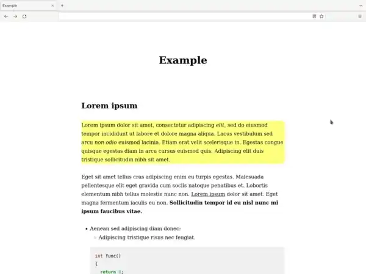

Introduction
------------

Scrollem is a simple tool for highlighting bullet points and paragraphs in a page.

While slide-based presentations have their place, sometimes I like to present by just going over the full lecture notes text (or scroll) in a browser. In this mode I used to focus on pieces of text by selecting them with the mouse, but found that unsatisfactory. It's much nicer to be able to go throw the text and highlight paragraphs and bullet points in order as you scroll down.

Scrollem provides a JavaScript function that highlights `li` and `p` elements in an HTML page, using the up and down arrows to move the highlighting. There is also a script provided to convert Markdown to Scrollem-using HTML with [Pandoc](https://pandoc.org/).



Usage
-----

To use Scrollem in an HTML document, just add this at the end:

```html
<script src="scrollem.js"></script>
```

But the better way is to write the document in Markdown and convert it to HTML using the `scrollem.sh` ([Pandoc](https://pandoc.org/) required). The resulting HTML is linked to the CSS and JavaScript.

    ./scrollem.sh example.md --metadata title="Example" --output=example.html

All the parameters are passed to Pandoc, see [options](https://pandoc.org/MANUAL.html).

* Toggle *presentation* and *normal* modes with the `p` key.
* In presentation mode:
  - An element is highlighted.
  - Up and down arrow keys move the highlighting.
    + Scrolling with mouse and PgUp/PgDn keys works as usual.
  - Left clicking and element highlights it.
  - Left clicking a link does not open it
    + Right and middle click work as usual.
* In normal mode:
  - Element highlighting is turned off.
  - Up and arrow keys scroll
  - Left clicking a link opens it